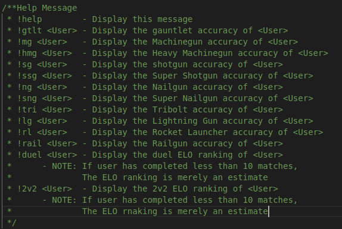

# quakeBot

*Installation insctions*
- Run: npm install
- Create File: auth.json
  -- auth.json needs a "token" field with the token associated with your bot 
- Start up bot.js: node bot.js

*Bot Information*

This repository contains the code for a discord bot that will pull stats for users from the stats.quake.com API for the game Quake Champions. The bot listens on the discord server specified by the auth.json file for commands starting with an excamation mark '!' 
BotHelp.png file contains an image fo the available commands that the Bot recognizes.
  - image URL for the help message is the same as BotHelp.png but hosted on imgur.

